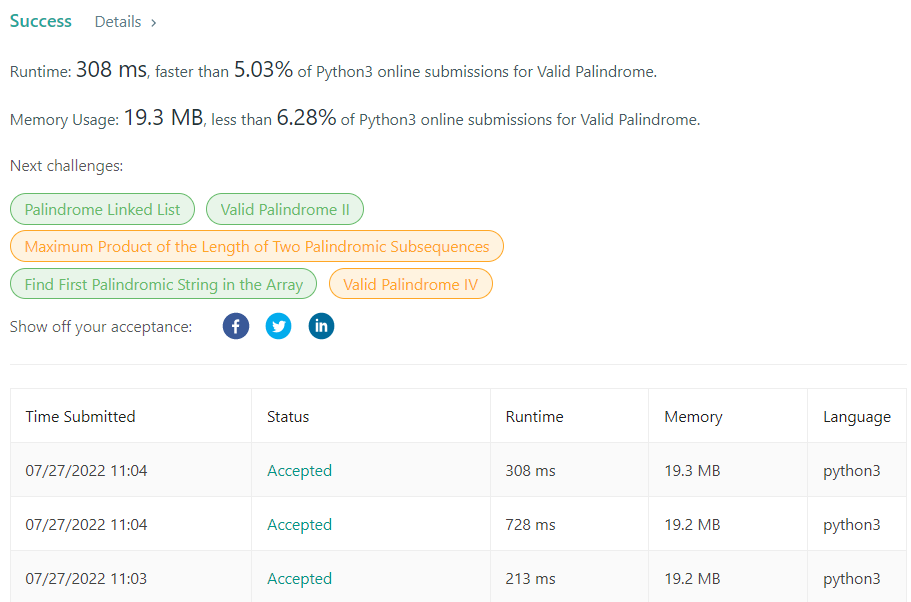

## 풀이1) 리스트 변환

isalum() 과 lower() 를 사용하여 입력값 배열에 저장
> ● isalum()<br/>
영문자, 숫자 여부를 판별하는 함수 (영문자:True, 숫자:False)<br/>
> ● low()<br/>문자를 모두 소문자로 변환시킴(소문자인 경우 그대로 출력)

```python
strs = []
    if char.isalnum():
        strs.append(char.lower())
```

<br/>

pop() 를 사용하여 배열의 맨 앞 과 끝 을 비교하여 다르면 False 반환
>● Array.```pop(index)```<br/>Array에서 지정한 index 요소를 꺼내와 return 해줌. (해당 요소 Array에서 제거)<br/><br/>
>● len(): 길이 값 반환

```python
while len(strs) > 1:
    if strs.pop(0) != strs.pop():
        return False

return Ture
```

Array(배열)은 물리적 메모리에 연속적으로 저장되어 있기 때문에 데이터의 삭제 및 삽입 시 메모리 공간을 한 칸씩 당기거나 미루는 과정이 필요하다. <br/>
따라서 ```pop(0)```은 **O(n)의 시간 복잡도**를 가져 **전체 시간 복잡도는 O(n²)** 가진다.




<br>

## 풀이2) Deque 최적화

Deque 자료형으로 최적화
> ### 🤔 Deque란? 
> 양쪽으로 데이터 삽입, 삭제가 가능한 자료형 (스택 + 큐)<br/>
> pop(0) -> popleft(): O(1) 

<br>

deque 가져오기

```python
from collections import deque       # JavaScript랑 순서 반대
```

<br>

deque 선언
```python
strs: Deque = deque()
```
<br>

pop(0) -> popleft()
```python
while len(strs) > 1:
    if strs.popleft() != strs.pop():
        return False
```

Array -> deque 로 자료형을 변환 
O(n)의 시간복잡도로 설계가 가능하다. 

