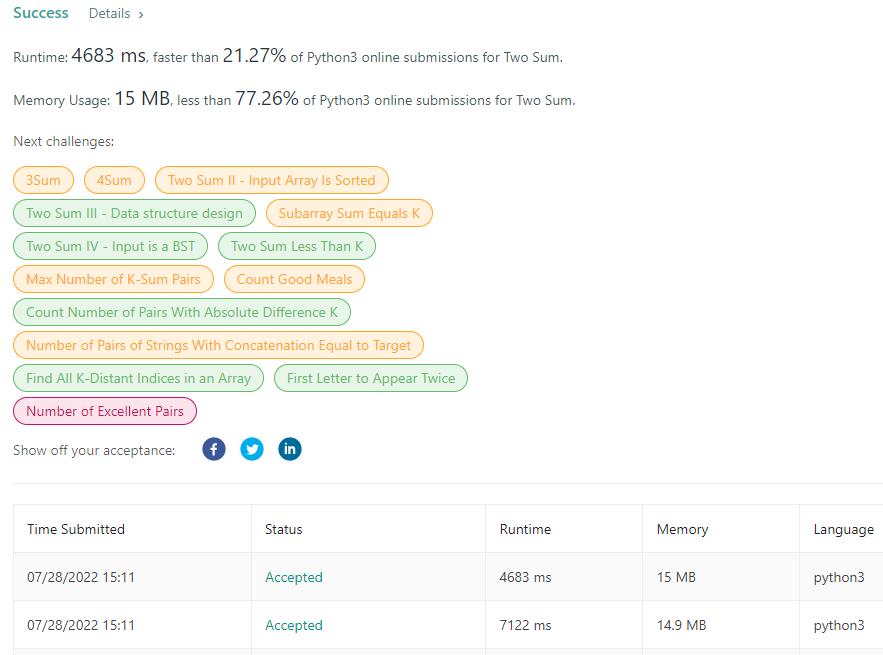
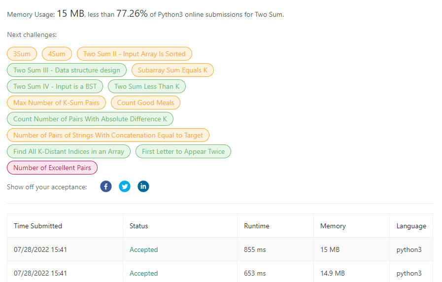
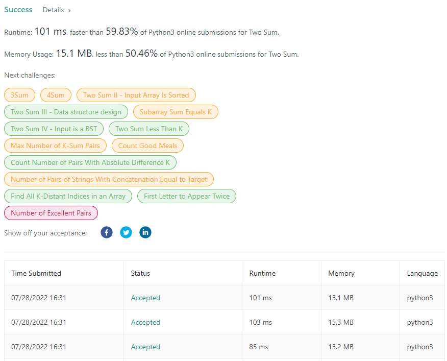

매우 쉬운 문제이지만 최적화 할 수 있는 여러가지 방법이 많이 숨어 있어 코딩테스트에 높은 빈도로 출제되는 유형이다.

<br/>

## ✍️ 풀이1(브루트포스)
> ### ● 브루트포스(Brute Force)<br>
> 조합 가능한 모든 문자열을 하나씩 대입해 보는 방식

<br/>

시간복잡도: O(n²)<br/>
모든 경우를 다 비교하여 해를 구하는 경우 매우 비효율적인 풀이다.


<br/><br/>


## ✍️ 풀이2(in탐색)
```[target(주어진 값)-n(첫째 값)]=나머지값``` 을 나머지 요소들와 비교하여 탐색한다.

<br/>

```enumerate()```를 통해 각 요소의 index와 value 값을 추출한다.
```python
for i, n in enumerate(nums):
```
<br/>

```in탐색```으로 나머지 값 유무 확인 
```python
 if complement in nums[i+1:]:
```

<br/>

나머지 값이 남은 요소들 안에 있을 시 해당 인덱스들 추출<br/>
```nums[i+1:].index(complement)```이 i+1부터 0의 index로 return되기 때문에 i+1을 더해야한다.
```python
return [nums.index(n), nums[i+1:].index(complement)+(i+1)]
```
<br/>



같은 브루트포스와 같은 O(n²)의 시간 복잡도를 가지지만 ```in탐색```연산이 훨씬 빠르고 가볍다. <br/>
(in은 파이썬 내부 함수로 구현되어 파이썬 레벨에서 매번 값을 비교하는 for문보다 빠르다. )

<br/><br/>


## ✍️ 풀이3(딕셔너리)
```Dictionary(key:요소, value:index)``` 형태로 탐색을 하지 않고 한번에 해당하는 값 추출

<br>

```Dictionary(key:요소, value:index)``` 생성
```python
num_map = {}
for i, n in enumerate(nums):
    num_map[n] = i
```

<br/>

나머지 값 존재 여부 판단하고 key로 value(index) 한번에 추출한다.
```python
 for i, n in enumerate(nums):
    if target - n in num_map and i != num_map[target-n]:
        return [i, num_map[target-n]]
```

<br/>

중복 제거(for문: 2개 -> for문: 1개)
```python
for i, n in enumerate(nums):
    if target-n in num_map:
        return [num_map[target-n], i]
    num_map[n]=i
```




<br/><br/>


## ✍️ 풀이4(투포인터): X

```python
left, right = 0, len(nums)-1
while not left == rigth: # (left == rigth) = False인 경우
    if nums[left] + nums[right] < target:
        left += 1
    elif nums[left] + nums[right] > target:
        right -= 1
    return [left, right]
```
투포인트를 이용해 O(n) 풀이가 가능하지만 해당 풀이는 오름차순으로 정렬(sort, sorted)을 해야 가능한 풀이다.

따라서 정렬을 하게 되면 처음 주어진 요소들이 섞여 index를 찾을 수가 없다. 

투포인트 풀이는 value을 추출하는 경우에 쓰자. (O(n)에 직관적인 좋은 풀이임.) 

<br/><br/>
