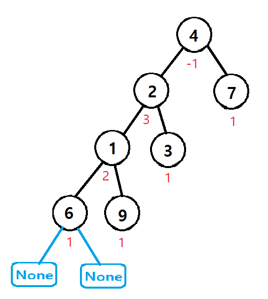

​
# ✍️ 풀이1(DFS-재귀)

높이 균혀은 모든 노드의 서브 트리 간의 높이 차이가 1 이하인 것을 말한다.

### ● 전체코드

```python
def isBalanced(self, root: Optional[TreeNode]) -> bool:
        def check(root):
            if not root:
                return 0
            
            left = check(root.left)
            right = check(root.right)
            if left == -1 or right == -1 or abs(left - right) >1:
                return -1
            return max(left, right) + 1
        return check(root) != -1
```

<br/>

재귀로 리프 노드까지 탐색하여 left=0, right=0 으로 intialize한다.


<br/>

### 높이 균형: True


<br/>

### 높이 균형: False

