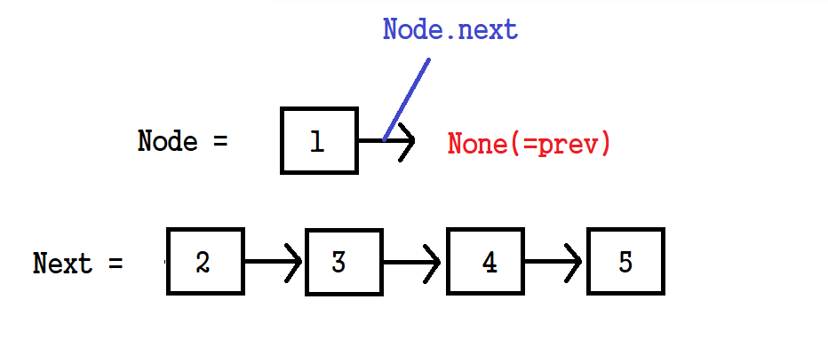
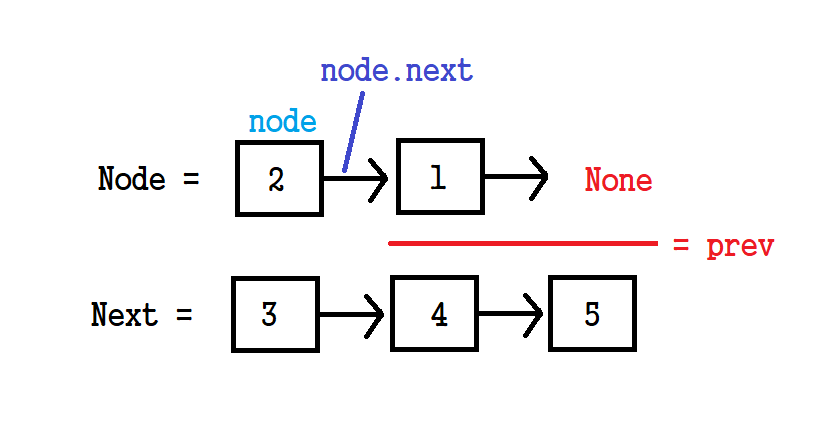
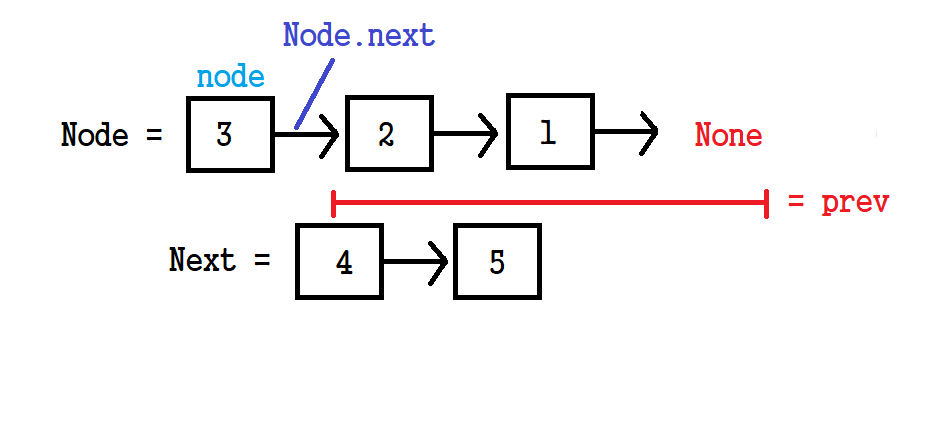
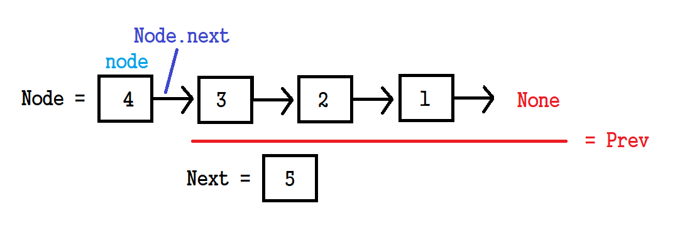
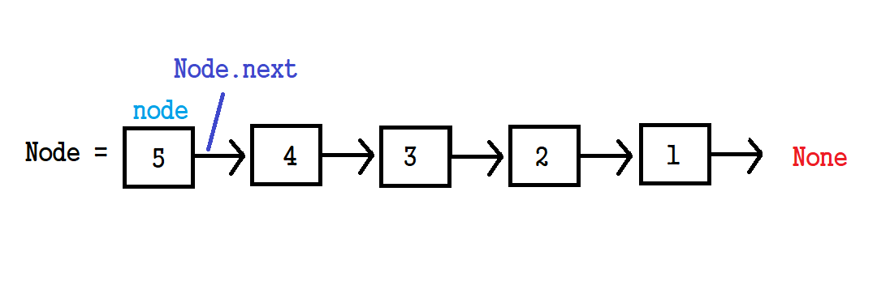

# ✍️ 풀이1(반복)
### 1. prev, curr: initialize(초기화)
```python
prev, curr = None, head
```

### 2. 포인터 뒤집기
```python
while curr:
    next, curr.next = curr.next, prev
    prev, curr = curr, next # prev(이전), curr(현재) 노드 포인터 전진
```
```next = curr.next```를 통해 다음 노드들의 참조 값을 복사한다.

```curr.next = prev``` 로 역순으로 재배치한다.

```prev, curr = curr, next``` 로 node들의 포인터를 한칸 전진시킨다.

<br/>
<br/>

# ✍️ 풀이2(재귀)

```python
def reverse(node: ListNode, prev: ListNode = None):
    if not node:
        return prev
    next= node.next
    node.next = prev
    return reverse(next, node)
return reverse(head)
```

```next = node.next``` 통해 다음 노드들의 참조 값을 복사하고

```node.next = prev``` 으로 역순으로 재배치한다. 

각 단계마다 처리된 결과를 인자로 주어 재귀를 통해 진행한다.

```node=None``` 인 경우 prev를 return하고 종료시킨다.

<br/>


재귀호출을 통해 진행되는 과정은 아래의 그림들과 같다. 

### 1. 첫번째 재귀호출 




>  ● 인자 <br/>
node=head, prev=None

> ▶ 결과<br/>
> next = {val=2, next={val=3, next={val=4, next={val=5, next=None}}}}<br/>
> node = {val=1, next=None}


<br/>

### 2. 두번째 재귀호출





>  ● 인자 <br/>
> node = {val=2, next={val=3, next={val=4, next={val=5, next=None}}}}}<br/>
> prev = {val=1, next=None}

> ▶ 결과<br/>
> next = {val=3, next={val=4, next={val=5, next=None}}}<br/>
> node = {val=2, next={val=1, next=None}}


<br/>

### 3. 세번째 재귀호출



>  ● 인자 <br/>
> node = {val=3, next={val=4, next={val=5, next=None}}}<br/>
> prev = {val=2, next={val=1, next=None}}

> ▶ 결과<br/>
> next = {val=4, next={val=5, next=None}}<br/>
> node = {val=3, next={val=2, next={val=1, next=None}}}


<br/>

### 4. 네번째 재귀호출



>  ● 인자 <br/>
> node = {val=4, next={val=5, next=None}}<br/>
> prev = {val=3, next={val=2, next={val=1, next=None}}}


> ▶ 결과<br/>
> next = {val=5, next=None}<br/>
> node = {val=4, next={val=3, next={val=2, next={val=1, next=None}}}}


<br/>

### 5. 마지막 재귀호출



>  ● 인자 <br/>
> node = {val=5, next=None}<br/>
> prev = {val=4, next={val=3, next={val=2, next={val=1, next=None}}}}


> ▶ 결과<br/>
> node = {val=5, next={val=4, next={val=3, next={val=2, next={val=1, next=None}}}}}


# ✍️ 풀이2(재귀)


---
Reference)<br>
https://www.youtube.com/watch?v=D7y_hoT_YZI<br/>
https://www.youtube.com/watch?v=G0_I-ZF0S38
