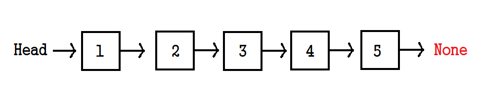
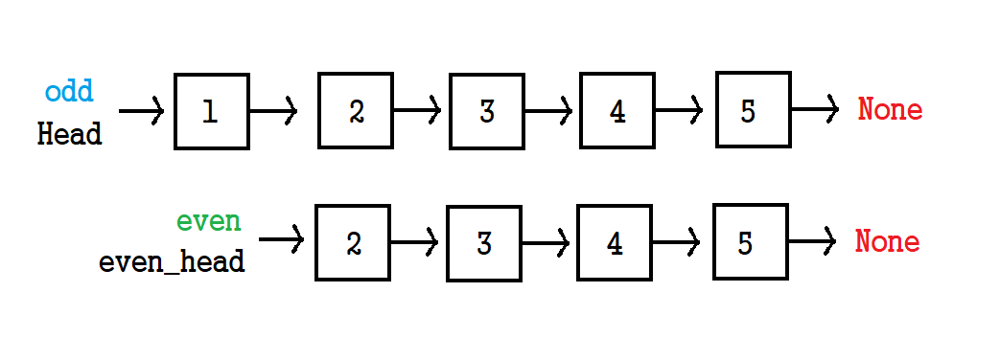
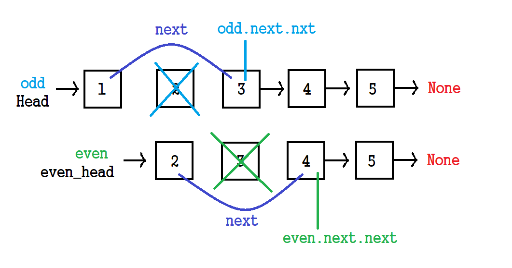
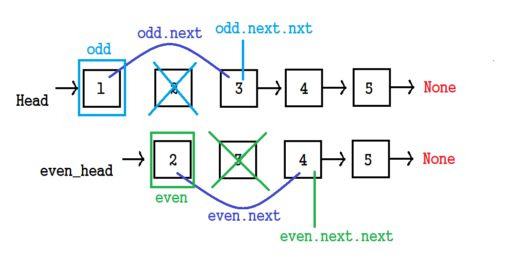
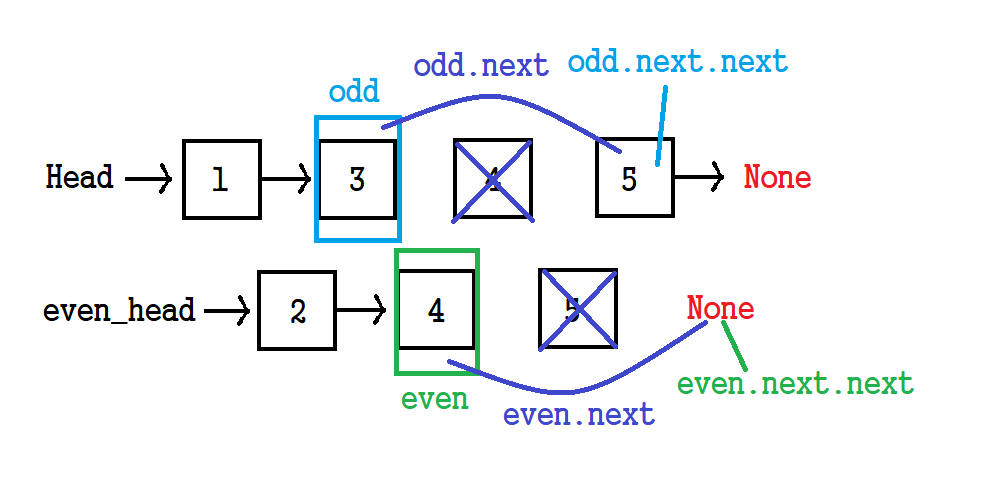

# ✍️ 풀이1(반복)
### 👉 전체코드

```python
if head is None:
    return None

odd = head
even = head.next
even_head = head.next #홀수와 연결할 짝수 head

# 반복하면서 홀짝 노드 처리
while even and even.next:
    odd.next, even.next = odd.next.next, even.next.next
    odd, even = odd.next, even.next
    
# 홀수 노드의 마지막을 짝수 헤드로 연결
odd.next = even_head
return head
```

<br/>

## 👉 풀이과정)


### 입력 받는 연결리스트(head)



<br/>

### 1. odd(홀수), even(짝수) 초기화?


<br/>

```python
odd = head
even = head.next
even_head = head.next #홀수와 연결할 짝수 head
```

홀수: ```odd = head```, odd 변수에 연결리스트 전체 복사<br/>
짝수: ```even= head```, even 변수에 다음 Node부터 끝 Node까지 복사

짝수 연결리스트 head 지정하기(🤔 why? 홀수 연결리스트 뒤에 붙이기 위해서 )<br/>
-> ```even_head = head.next```

<br/>

### 2. while 1



<br/>

```python
while even and even.next:
    odd.next, even.next = odd.next.next, even.next.next
    odd, even = odd.next, even.next
```


<br/>


### 3. whil 2



<br/>

```python
while even and even.next:
    odd.next, even.next = odd.next.next, even.next.next
    odd, even = odd.next, even.next
```


<br/>


### 4. 홀수(odd) 연결리스트, 짝수(even) 연결리스트




<br/>


### 5. 홀수, 짝수 연결리스트 연결


<br/>

```python
odd.next = even_head
return head
```