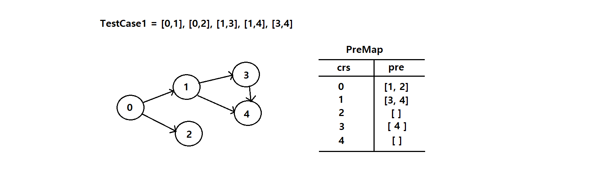
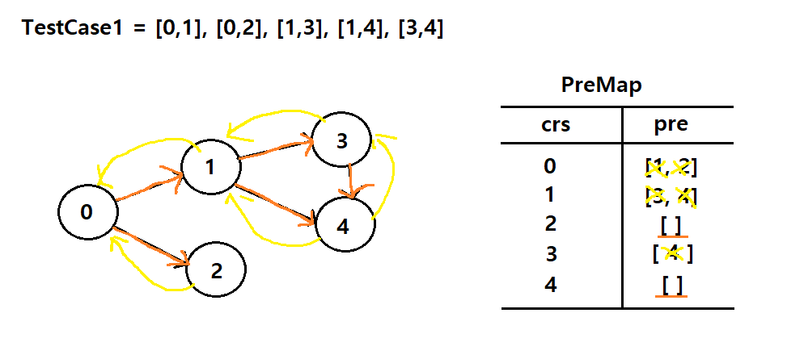
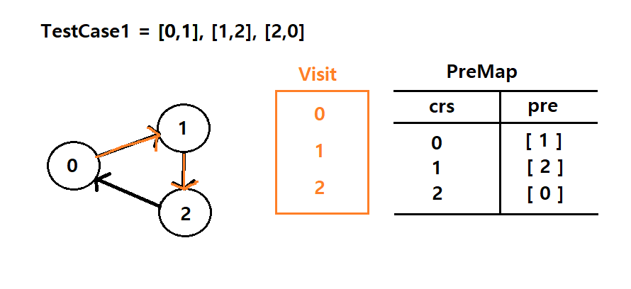
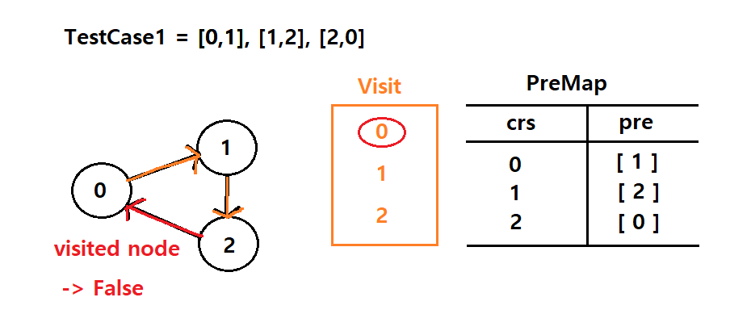

# 그림을 통한 이해​ 

이해하기까지 좀 오래 걸렸다...<br/>
 yotube에서 설명한 내용을 통해 이해한 부분을 그림으로 만들었다.

## 👉 TeseCase1






<br/>

## 👉 TestCase2







----

Reference)<br/>
https://www.youtube.com/watch?v=EgI5nU9etnU

<br/>


# ✍️ 처음 작성한 풀이)

위의 이해를 바탕으로 직접 작성한 코드이다.

```python 
from collections import defaultdict

class Solution:
    def canFinish(self, numCourses: int, prerequisites: List[List[int]]) -> bool:
        graph = defaultdict(list)
        visit = []
        
        for a, b in prerequisites:
            graph[a].append(b)
        
        def dfs(crs, pre):
            visit.append(crs)
            if len(pre) == 0:
                return 
            
            for n in pre:
                if n in visit:
                    return False
                dfs(n, graph[n])
                
            return True
        
        if not dfs(0, graph[0]): false
        
        return True
```

visit list를 만들어 방문한 노드를 기록하고 재귀로 노드를 탐색하여 방문한 노드 여부를 판단하여 순환구조를 확인하는 형태로 작성했다.  

해당 풀이로는 정답을 도출할 수 없었다...

<br/>

> 🤔 생각하지 못했던 부분은?

우선 순환이 아닌데 잘못 판단 될 수 있는 경우를 생각하지 못했다.

```testcase = [0, 1], [0, 2], [1, 2]``` 의 경우 형제 노드가 방문한 노드까지 visit에 기록되어 순환이 아닌데도 순환으로 오판되었다.

해당 노드의 탐색이 모든 완료된 경우 방문한 내역을 삭제 해야 되었다.  


<br/>

또한 ```visit=[]``` 으로 작성하여 중복 되는 값을 같는 경우 Error가 발생되었다.

-> ```set()```로 중복을 걸러주거나 ```[0 for _ in range(numCourses)]```로 방문 여부를 직접 지정하는 경우로 해결 되었다.


<br/>


# ✍️ 풀이1(DFS-재귀)

```python
if not dfs(crs): return False
```
위 코드에서 약간 멘붕이 왔다.

파이썬의 함수는 1급 객체 이다.
> ### ● 1급 객체의 특징
>1.  값으로써 변수에 할당 가능
>2. 함수의 인자 나 return 값으로 가능
>3. 제어문[조건문(if..), 반복문(while..)]에서 사용 가능 (고차함수)

따라서 위의 코드처럼 함수를 값으로써 비교할 수 있다.

재귀구조로 복잡한 함수도 결국 value를 return 하기 때문에 문제가 없다.

별거 아닌건데 머리가 이해하기를 거부했다...(왜그런지 모르겠음...)

<br/><br/>

# ✍️ 풀이3 - 가지치기를  이용한 최적화 


위 그림과 같이 이미 dfs로 순환이 판별된 부분이 다시 반복되어 비용 낭비가 발생한한다. 

따라서 방문 노드를 저장할 새로운 ```set()``` 집합을 만든 후
이미 방문하여 판별된 노드이면 건너뛰어 비용 낭비를 개선할 수 있다.

```python
traced = set()
visit = set() # 방문 노드 저장
def dfs(crs):
    if crs in traced: return False
    if crs in visit: return True # 방문한 노드 시 건너뛰기
    
    traced.add(crs)
    for pre in preMap[crs]:
        if not dfs(pre): return False
    traced.remove(crs)
    visit.add(crs) # 순환 판별 후 저장
    
    return True
```

<br/>


또한 [풀이1]과 같이 방문한 노드를 저장하지 않고도 처리 가능하다.

```python
def dfs(crs):
    if crs in visitSet:
        return False
    if preMap[crs] == []: # 순환이 판별 or 노드 끝 -> return
        return True
    
    visitSet.add(crs)
    for pre in preMap[crs]:
        if not dfs(pre): return False
    visitSet.remove(crs)
    preMap[crs] = [] # 순환 판별된 노드 비우기 
    return True
```

위 코드와 같이 이미 판별된 node를 비워, 쓸데없는 연산 낭비를 방지한다. 

> 🤔  위 방법보다 set으로 처리하는 방식이 더 빠르게 처리 되었으나 해당 부분이 왜 그런지 이해가 가지 않았다.<br/>
-> 추후 이해되면 정리


<br/><br/>

# ✍️ 풀이2 - leetcode
[leetcode](https://leetcode.com/problems/course-schedule/discuss/58586/Python-20-lines-DFS-solution-sharing-with-explanation)에서 참조한 코드로 정리한 3가지 풀이 중 가장 빠른 풀이이다.

>There are a total of numCourses courses you have to take, labeled from 0 to numCourses - 1

해당 조건을 통해 graph를 배열로 설정하여 index로 node 구별하는 방법이 신기했다. (난 왜 이런 생각이 안들었나 모르겠네...) 
```python
graph = [[] for _ in range(numCourses)]
```

또한 index로 node를 구별하여 아래와 같은 코드로 순환과 방문 판별을 간단하게 처리하는 부분이 굉장히 신박했다.
```python
visit = [0 for _ in range(numCourses)]
```

<br/>

>순환 판별: -1<br/>
방문 판별: 1

```python 
def dfs(i):
    if visit[i] == -1:
        return False
    if visit[i] == 1:
        return True
    visit[i] = -1
    for j in graph[i]:
        if not dfs(j):
            return False
    visit[i] = 1
    return True
```

