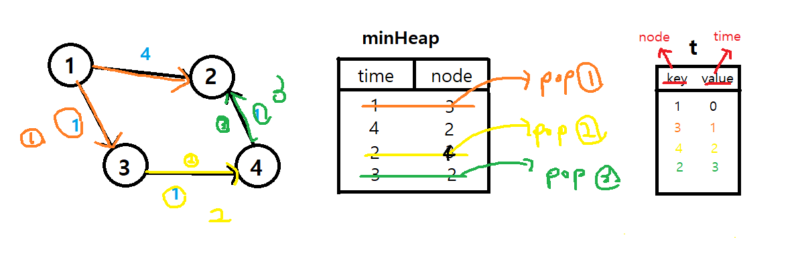

# ✍️ 풀이1(우선순위 큐(heapq))
>다익스트라 -> 우선순위 큐(heapq모듈) <br/>
>시간복잡도: O(Elogv)


<br/>

## TastCase)
> times=[[1,3,1],[3,4,1],[4,2,1],[1,2,4]], N=4, k=1

graph 인접리스트로 구성

```python
graph =  collections.defaultdict(list)
for u, v, w in times:
    graph[u].append((v, w))
```

<br/>



 위 그림과 같이 진행되어 정답이 도출

```python
minheap, t = [(0, K)], {}
while minheap:
    time, node = heapq.heappop(minheap) # tuple: (x, y) -> x기준 
    if node not in t:
        t[node] = time
        for v, w in graph[node]:
            heapq.heappush(minheap, (time + w, v)) 
return max(t.values()) if len(t) == N else -1
```


<br/>

----
Reference)<br/>
https://www.youtube.com/watch?v=EaphyqKU4PQ&t=873s