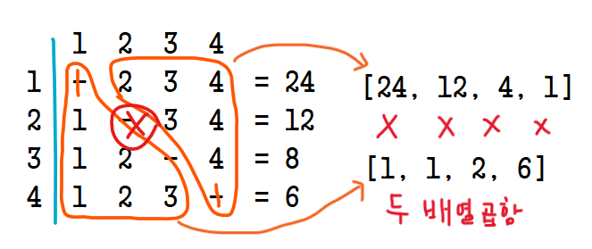

​
# ✍️ 풀이1(왼쪽 X 오른쪽)

해당 문제는  나눗셈을 사용하지 않고 자신을으 제외한 요소를 모두 곱한 list를 구하는 것이다.
따라서 아래와 같이 2가지 case로 나누어 곱셈처리한다. 

<br/>



<br/>

### Case1) left
```python
p=1
for i in range(len(nums)):
    list.append(p)
    p = p * nums[i]
```

<br/>

### Case2) right
```python
 p=1
for i in range(len(nums)-1, 0-1, -1):
    list[i] = list[i] * p
    p = p * nums[i]
```


