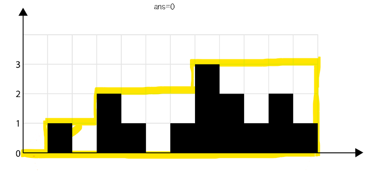
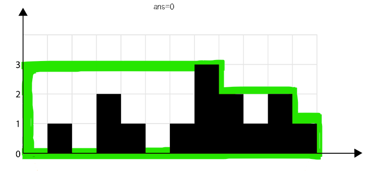
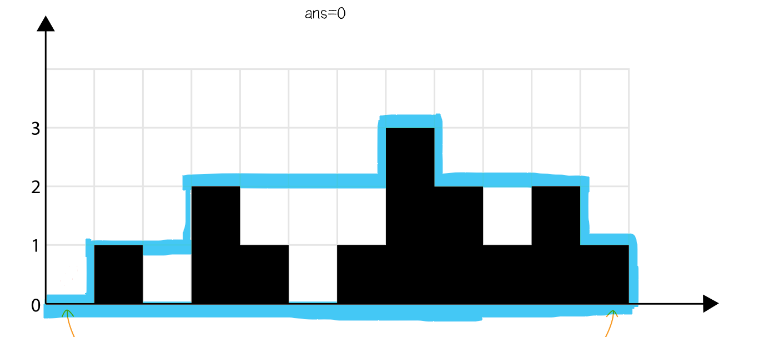

# ✍️ 풀이1-1(투포인터)
투포인터(left, right)로 max()를 통해 최댓값을 갱신하며 volume을 구한다.
```python
left, right = 0, len(height) - 1
left_max, right_max = height[left], height[right]

while left < right:
    left_max, right_max = max(height[left], left_max), max(height[right], right_max)
```

left_max 와 right_max 를 비교하여 포인터가 가장 큰 값(높이)에 도착했을 때 더이상 진행되지 않게 처리한다. 

```python
while left < right:
     ...
    
    if left_max <= right_max:
        volume += left_max - height[left]
        left += 1
        
    else:
        volume += right_max - height[right]
        right -= 1
```

<br/><br/>

# ✍️ 풀이1-2(투포인터)
투포인터와 배열을 이용한 풀이이다. 
각 포인터(left, right)를 양쪽 끝까지 이동시키며 ```max()``` 를 통해 최대의 높이만 추출해```min()```를 이용하여 최적의 넓이를 구한 후 높이 면적을 빼서 해를 구한다.

<br>

### 1) left 포인터, max() 


```python
 for h in height:
    left = max(left, h) 
    waterLevel += [left]      
```


<br/>

### 2) right 포인터, max()


```python
right = 0
for i, h in reversed(list(enumerate(height))):
    right = max(right, h)
```

<br/>

### 3) 최적넓이(min) - height 넓이 = 빗물 넓이


```python
for i, h in reversed(list(enumerate(height))):
        ...
    waterLevel[i] = min(waterLevel[i], right) - h 
```


<br/><br/>

# ✍️ 풀이2(Stack)
이해하기 어렵다... 이해 후 정리