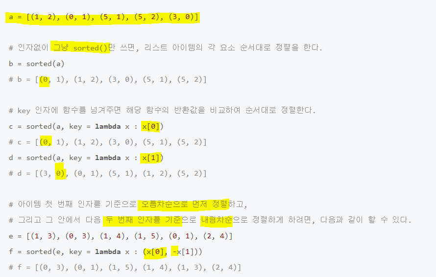

# Algorithm 풀이 정리
- 백준허브
- leethub

<br/>
<br/>

## ✍️ 파이썬 내장함수들
<br/>


#### map(function, iterable)

첫 번째 매개변수로는 함수, 두 번째 매개변수로는 반복 가능한 자료형(리스트, 튜플 등)이 온다.

map 함수의 반환 값은 map객체 이기 때문에 해당 자료형을 list 혹은 tuple로 형 변환시켜주어야 한다.

map함수는 두번째 인자로 들어온 반복 가능한 자료형(리스트 or 튜플)을 첫번째 인자로 들어온 함수에 하나씩 집어넣어서 수행한다. 

```python
ex)
map( 값에 +1 을 더해주는 함수, [1,2,3,4,5]) 
 -> [2,3,4,5,6]
```

Reference)
https://blockdmask.tistory.com/531


<br/>
<br/>

### ● lambda
    -> lambda 매개변수 : 표현식

#### ✍️ 예시)

ex1 = [[1, 2], [3, 4], [5, 6], [3, 6], [5,9]]

ex1.sort(key = lambda x : x[0], -x[1]) 
    -> [[1, 2], [3, 6], [3, 4], [5, 9], [5, 6]]

>x[0]: 첫번째 요소, 오름차순 정렬
>-x[1]: 두번쩨 요소, 내림차순 정렬
>  -> (-1)x[n]: n-1 요소, (내림)오름차순 정렬



Reference) https://wikidocs.net/64


<br/>
<br/>
