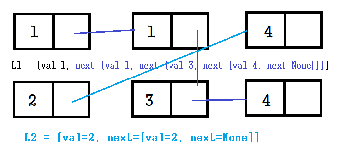
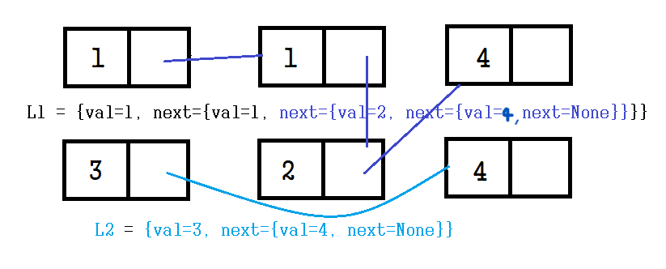
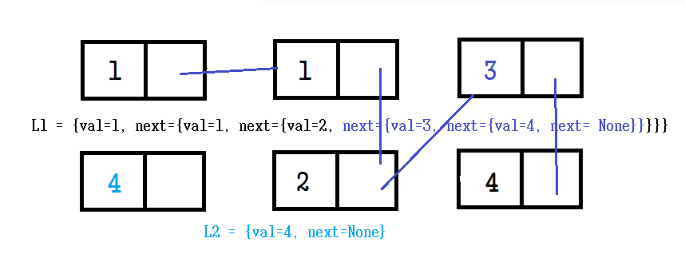
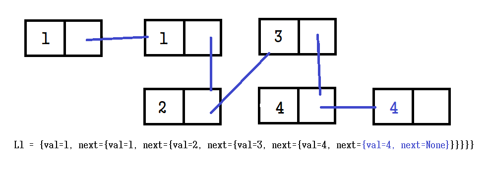

# ✍️ 풀이1(dummy)
새로운 연결리스트를 만들어 두 연결리스트 값을 비교하여 작은 값을 덧붙여 나가는 방식

>🤔 왜 dummy로 초기화하고 tail에 다시 참조하는지 모르겠음. 바로 dummy를 쓰거나, tail에 초기화 시키면 안되나? <br/>
> -> 연결리스트를 출력할 가장 앞 노드(```dummy```), 노드를 넘겨줄 변수(```tail```)<br/>
>-> 새로운 연결리스트를 만들어 비교하는 연결리스트들의 Node의 value 값을 비교하여 추가한다. <br/>
>-> 새로운 연결리스트를 만드는 방법 중 하나(🤔 다른 방법도 있나?)로 dummy Noode를 만들어 그 다음 값부터 value를 저장하여 이어 붙인 후 dummy.next로 이어붙인(구하는) 연결리스트를  추출한다. 

dummy 변수로 비어있는 새로운 연결리스트를 만들고 L1, L2 각 노드의 value 값을 비교하여 추가하는 형태로 진행한다. 

tail 변수를 통해 새로 만든  연결리스트의 Node를 넘긴다. 

```python
dummy = ListNode(None)
tail = dummy

while list1 and list2:
    if list1.val < list2.val:
        tail.next = list1
        list1 = list1.next
    else:
        tail.next = list2
        list2 = list2.next
    tail = tail.next

if list1:
    tail.next = list1
elif list2:
    tail.next = list2

return dummy.next
```

출력 시 초기화 시 만든 dummy 데이터 다음인, 실제 데이터를 저장한 부분부터 추출한다.<br/>
-> ```dummy.next```

<br/>
<br/>

# ✍️ 풀이2(재귀)
재귀 호출, 이해하는데 참 오래걸렸다... 결국 공책에 쓰고 case를 차례로 정리했더니 이해가 되었다. 그러나 막상 재귀풀이로 문제를 해결하려면 연습을 더 해야할 듯 하다...

<br/>

```python
L1, L2 = list1, list2
if (not L1) or (L2 and L1.val > L2.val):
    L1, L2 = L2, L1
if L1:
    L1.next = self.mergeTwoLists(L1.next, L2)
return L1
```

로직 자체는 굉장히 짧지만 그 안의 내용을 이해하는데 엄청 힘들었다...

<br/>


## 1. 첫번째 재귀호출


L1 조건을 만족하기 때문에 재귀호출을 시작에 L1.next 와 L2를 인자로 넘겨준다. 
> ● 인자<br/>
>L1.next = {val=2, next={val=4, next=None}} <br/>
>L2 = {val=1, next={val=3, next={val=4, next=None}}}ㅇ

<br/>

## 2. 두번째 재귀호출



```L2 and L1(=L1.next).val > L2.val``` 조건을 만족하기 때문에 위 그림처럼 ```L1(=2)``` 과 ```L2(=1)``` Node를 스왑한다. 

>이해가 많이 걸렸던 부분은 **스왑처리 시 다음 Node들도 묶어서 같이 딸려간다**는 부분이었다. 위 그림처럼 ```객체 형태```로 정리 후 이해가 되었다.
>
>연결리스트에서의 스왑을 ```배열과 같이 각각의 요소만 변경```하는 것으로 생각하여 각 Node만 변경하는 것으로 생각하여 생긴 착각이었다.
>
>배열은 물리적메모리에서 연속적으로 할당되어 index를 통해 데이터를 접근하기 때문에 스왑처리를 하여도 각 요소들만 변경되지만 
>
>연결리스트는 ```포인터로 연결```하여 데이터를 담고 있는 Node에 다음 Node(메모리주소)도 담고 있기 때문에 Node를 스왑 시 연결되어 있는 모든 Node가 같이 스왑된다.

<br/>

> ### 👉 연결리스트 <br/>
>포인터로 데이터를 연결하기 때문에 Class를 통해 각 Node라는 ```객체```를 만들고 next라는 ```변수```를 통해 다음 Node의 ```메모리 주소```를 할당하여 데이터를 연결한다.  

<br/>

L1(L1.next)이 존재하기 때문에 ```L1.next(L1.next.next)``` 와 ```L2```를 인자로 넘겨주고 다시 재귀호출을 한다. 
> ● 인자<br/>
>L1.next={val=3, next={val=4, next=None}}<br/>
>L2= ={val=2, next={val=4, next=None}}

<br/>

## 3. 세번째 재귀호출



받아온 인자인 L1(L1.next.next) 와 L2 에서 <br/>
```L2 and L1.val(=3) > L2.val(=2)```  조건을 만족하기 때문에 다시 스왑처리를 한다.

스왑처리 후는 위 그림과 같다. 

L1 조건을 만족하기에 L1.next(L1.next.next.next)와 L2를 인자로 넘겨주어 다시 재귀 호출을 한다. 
> ● 인자<br/>
> L1.next={val=4, next=None}<br/>
> L2 = {val=3, next={val=4, next=None}}

<br/>

## 4. 네번째 재귀호출



L2 and L1.val(=4) > L2.val(=3)을 만족하기 때문에 다시 스왑처리를 한다.
결과는 위 그림과 같다.

L1이 None이 아니기 때문에 다시 L1.next와 L2를 인자로 주고 재귀호출을 한다.

> ● 인자<br/>
> L1.next = {val=4, next=None}<br/>
> L2 = {val=4, next=None}

<br/>


## 5. 다섯-여섯번째 재귀호출


받아온 인자 L1, L2 에서 L1.val(=4) = L2.val(=4) 이기에 스왑 로직은 건너뛰고 
L1이 None 아니기 때문에 다시 재귀호출을 한다.
> ● 인자<br/>
>L1.next = None<br/>
> L2 = {val=4, next=None}

```L1=None``` 이므로 위 그림과 같이 마지막으로 스왑을 처리를 하고 백트래킹을 종료하고 L1을 return한다. 

