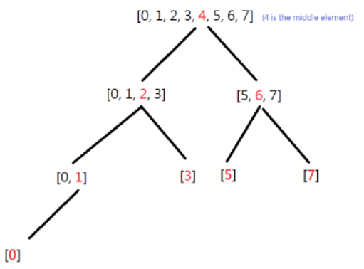

​
# 풀이1(재귀)
이미 정렬된 리스트를 주기 때문에 따로 정렬 처리를 할 필요는 없다.



<br/>

중간 index 기준으로 TreeNode 생성 및 탐색을 시작한다.

```python
mid = len(nums) // 2
```

<br/>

중간(mid) 값 TreeNode 생성

```python
node = TreeNode(nums[mid])
```

<br/>

mid를 기준으로 왼쪽, 오른쪽 list를 넘겨 재귀 탐색 
```python
# 재귀로 탐색
node.left = self.sortedArrayToBST(nums[:mid]) # mid를 기준으로 왼쪽 요소들
node.right = self.sortedArrayToBST(nums[mid+1:]) # mid를 기준으로 오른쪽 요소들
```

