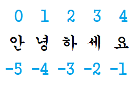
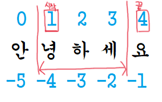
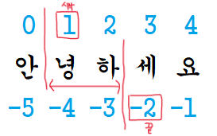
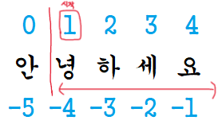
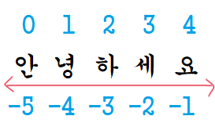

# ✍️ 문자열 슬라이싱

파이썬에서 제공하는 기능으로 ```위치를 지정```하여 해당 ```위치의 배열 포인터를 얻``` 어 연결된 객체의 value 값을 찾는다.
C언어로 설계가 되어 매우 빠르게 동작한다. 따라서 문자열 조작할 때, 항상 슬라이싱을 우선 시 하는 것이 속도 개선에 좋다.

<br>

### 👉  속도 비교 

<table>
  <tr>
    <td style="background-color:gray">알고리즘</td>
    <td style="background-color:gray">실행시간</td>
    <td style="background-color:gray">슬라이싱을 1로 했을 때 비율</td>
  <tr>
  <tr>
    <td>슬라이싱</td>
    <td>0.499마이크로초</td>
    <td>1</td>
  <tr>
  <tr>
    <td>리스트 reverse()</td>
    <td>2.46마이크로초</td>
    <td>5</td>
  <tr>
  <tr>
    <td>reversed() + join()</td>
    <td>2.49마이크로초</td>
    <td>6</td>
  <tr>
  <tr>
    <td>for 반복</td>
    <td>5.5마이크로초</td>
    <td>12</td>
  <tr>
  <tr>
    <td>while 반복</td>
    <td>9.4마이크로초</td>
    <td>21</td>
  <tr>
  <tr>
    <td>재귀</td>
    <td>24.3마이크로초</td>
    <td>54</td>
  <tr>
</table>

<br/><br/>

## ✍️ 예시)

<br/>



<br/>

```python
s = "안녕하세요"
```

<br/><br/>



<br/>

```python
s[1:4] == "녕하세" # 1부터 (4-1)까지
```

<br/><br/>



<br/>

```python
s[1:-2] == "녕하" # 1부터 (-2-1)까지
```

<br/><br/>



<br/>

```python
s[1:] == "녕하세요" # 1부터 끝까지
```
문자열의 '시작' or '끝'은 생략 가능하다. 

<br/><br/>



<br/>

```python
s[:] == "안녕하세요" 
```
```[:]```: '시작' 과 '끝'을 지정하지 않으면 전체를 복사해 리턴한다.  


파이썬은 할당 방식은 ```참조```이다. 따라서 ```'a = b'```는 ```변수 a가 변수 b를 참조```하는 형태로 할당된다. 따라서 참조가 아닌 복사를 위해 ```[:]```를 사용하며
이 방식은 문자열과 리스트를 복사하는 파이썬 다운 방식이다. 


<br/><br/>


<br/>

```python
s[1:100] == "녕하세요" # ( = s[1:])
```
인덱스가 지나치게 클 경우 문자열의 최대 길이만큼만 표시한다.

<br/><br/>

```python
s[-1] == '요'

s[-4] == '녕'

s[:-3] == '안녕' # 처음부터 -3-1('녕)까지
```

<br/>

```python
s[::1] == '안녕하세요' # 1은 기본값으로 [:]과 동일

s[::-1] == '요세하녕안' # 뒤집는다. (=reverse())

s[::2] == '안하요' # 2칸씩 복사하여 리턴
```